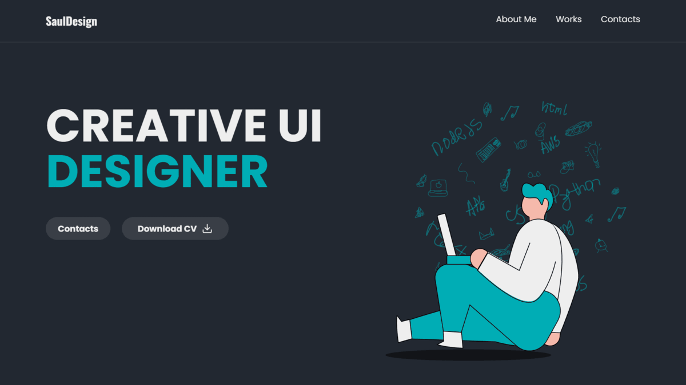

	
	<h1>OOD Portfolio</h1>

	
	
	
	 
	
	
	

 

	<a href="#-content">Content</a> •
	<a href="#-layout">Layout</a> •
	<a href="#-license">License</a>

***

	

***

## ♦ Content

- Header
	- Logo to Reload the Page
	- Navigation to Go to Sections
		- About
		- Works
		- Contacts
- CV
	- Left
		- Title
		- Button to Go to Contacts
		- Button to Download CV
	- Right
		- Decorative Image
- About
	- Left
		- Title
		- Paragraphs
	- Right
		- Decorative Image
- Works
	- Top
		- Title
		- Buttons to Apply Filters
	- Bottom
		- Images of Works
- Contacts
	- Left
		- Title
		- Decorative Image
	- Right
		- Top
			- Name Input Field
			- Email Input Field
		- Bottom
			- Message Input Field
			- Button to Send the Message
- Footer
	- Links to Go to Sections
	- Links to Go to Social Networks

***

## ♦ Layout

• Go to the [Layout Page](https://figma.com/community/file/1175755450846438274) to See It

***

## ♦ License

• OOD Portfolio are Distributed Under the GPL-3.0 License